# Deck Workflow

**这份文档的定位。** 本文定义 deck 级工作的主流程、workspace 结构、`brief.md` / `deck_narrative.md` 模板、以及从总叙事文档派生 `slide_specs.yaml` 的默认方式。它是新 skill 最重要的执行文档之一。

## 目录

- 主链路
- Workspace
- `brief.md` 最小模板
- `deck_narrative.md` 最小模板
- 派生 `slide_specs.yaml`
- 字段约定
- 验证模式
- 交付底线

## 什么时候先读它

**只要任务是做一整套 deck，就先读这份文档。** 它回答的问题是“这套材料怎么组织、怎么落 workspace、怎么验证”，比具体页面长相更优先。

## 主链路

**默认主链路固定为：** `intake -> source/template lock -> workspace_init -> deck_contract -> narrative -> slide_contracts -> planning_checkpoint -> asset_plan -> asset_production -> pptx_assembly -> package_preflight -> structure_precheck -> module_validation -> preview -> render_review -> visual_review -> first_draft_checkpoint -> detailed_revision(optional) -> final`。

```mermaid
flowchart LR
  A[Intake] --> B[Source / Template Lock]
  B --> C[Workspace Init]
  C --> D[deck_contract in brief.md]
  D --> E[deck_narrative.md]
  E --> F[Derived slide_contracts]
  F --> G[Planning Checkpoint]
  G --> H[Asset Plan]
  H --> I[Asset Production]
  I --> J[Editable PPT Assembly]
  J --> K[Package Preflight]
  K --> L[Structure Precheck]
  L --> M[Module Validation]
  M --> N[Preview Export]
  N --> O[Render Review]
  O --> P[Visual Review / Contact Sheet]
  P --> Q[First Draft Checkpoint]
  Q --> R[Final Delivery]
  Q --> S[Detailed Revision Optional]
  S --> J
```



**intake 用人话完成。** agent 应问清“这份 PPT 是发出去让别人自己看懂，还是配合你现场讲”“有没有必须沿用的模板或旧 PPT”“更像商业汇报、技术说明、研究材料，还是设计感演示”“后续是否还会改数据、图表或结构”。内部字段可以记录在合同里，不应把字段名直接抛给用户。

**先锁 source / template，再写 deck contract。** 用户给的 `pptx`、旧稿、品牌素材或风格样张，需要先判断是结构约束、风格参考、内容来源还是品牌边界。这个判断决定后面是否必须做 template audit，以及通用默认 typography 是否只能作为回退基线。

**先建 workspace，再写内容。** 整套 deck 任务应先落出标准 workspace。推荐使用 `scripts/init_deck_workspace.py` 创建目录、`brief.md` 和 `deck_narrative.md` 模板；如果手动创建，结构必须与本文 workspace 约定等价。

**先锁两份主文档，再 build。** 没有 `brief.md` 和 `deck_narrative.md` 时，不应直接开始生成 PPT。否则全局约束、页面意图与文案想法都会漂。

**“自由发挥”仍然经过阶段门。** 当用户把内容和设计取舍交给 agent 时，agent 仍然必须先把章节结构、页面任务、页面可见文案方向、资产需求和 layout 方向写进 `deck_narrative.md`。自由发挥代表判断授权，完整 build 仍需 workspace、narrative、slide contracts 和 checkpoint。

**有参考 `pptx` 时，模板取证是前置动作。** 先判断页族、母版、layout 和字号系统，再写 narrative。否则很容易把“模板继承”做成“风格模仿”。

**无模板但有风格参考时，先锁 profile。** 如果用户没有给参考 `pptx`，但明确要求正式研报、仿券商研报、产品发布会、学术答辩、电子杂志、Swiss Style 或某类行业范式，应在 `brief.md` 中先固化 `source_context`、`delivery_context`、`communication_profile`、`visual_profile`、`density_profile`、`editability_profile`、允许借鉴的视觉范式、禁止使用的品牌元素、免责声明和风险边界，再写 narrative。

**`slide_specs.yaml` 默认应派生，不应双写。** 机器执行仍然需要结构化字段，但默认应从 `deck_narrative.md` 生成，而不是要求人类长期维护第三份并行文档。

**在 narrative 阶段就要把增强资产选项告诉人类。** agent 应明确说明当前可用的 icon、原生 Office chart、Python figure、diagram、原生表格、普通图片和 GPT 生图路线，让人类按需指定更偏编辑性、更偏研究表达、还是更偏视觉节奏的方向。

**planning checkpoint 是 build 前阶段门。** 正式 deck、外发 deck、自解释 deck，以及用户要求“最高质量 / 研报风格 / 公开课 / 自由发挥”的任务，在完整 build 之前必须展示或记录 planning checkpoint。checkpoint 至少覆盖：全局基调、章节结构、逐页页面角色、逐页 `key_message`、可见文案方向、资产 / 配图需求、layout recipe 和 rhythm role。用户确认或明确授权继续后，才进入资产生产和 PPT 组装。

**asset_plan 统一由 slot 承载。** 图表、Python figure、diagram、icon、表格、普通图片和 GPT 生图都先登记为 `asset_slots`，再进入对应模块。PPT 组装阶段只消费 slide contracts 和已登记 slot，不在组装时临时发明页面逻辑。

**先 build 后 gate，再做模块验证。** 先确认文件包一致性和结构层排版没有明显失控，再去看 connector、chart 和模板细节。

**preview 之后还要补一次成图级 gate。** `render_review` 专门处理结构层看不到的边界触墨和扁平化图像风险，不要把逐页 preview 本身误当成结构化检查。

**final 前必须做 visual review。** `render_review` 通过只说明成图层没有触发自动阻断；它不证明页面已经像目标文体、版心已经稳定、表格语义对齐已经自然。final 前必须看逐页 preview 或 contact sheet，并按 `fatal -> warning -> preference` 记录人工 visual review 结论。

**初稿完成后要显式停一次。** 当 editable `pptx`、预览图、基础 validation 和 visual review 结论齐全时，应把它定义为“可审阅初稿”，并主动问人类是否要进入更细的详细修订。详细修订通常涉及逐页微调、图表路线切换、icon 节奏增强、模板细节对齐和措辞重写，token 消耗会明显更高。

**先结构验证，再视觉微调。** 如果某页同时有 connector 问题和版式问题，先修结构，再修样式。

## Workspace

**推荐工作空间如下。**

```text
deck_workspace/
  brief.md
  deck_narrative.md
  assets/
    diagrams/
    charts/
    icons/
    images/
      prompts/
      generated/
    tables/
  build/
    generated/
      slide_specs.yaml
    pptx/
    rendered/
      ppt_preview/
  validation/
  final/
```

**推荐初始化命令。**

```bash
python scripts/init_deck_workspace.py \
  --workspace-dir <path/to/deck_workspace> \
  --title "<deck title>"
```

**`brief.md` 放全局任务输入。** 目标读者、使用场景、模板约束、品牌要求、交付标准和验证要求都应在这里固定。它回答的是“为什么做这套 deck”和“哪些约束不能碰”。

**模板取证结果默认回写到 `brief.md`。** 不默认新增一份长期维护的 `template_audit.md`。页族判断、母版元素、字号系统和路线选择应作为 deck 级事实沉淀回主文档。

**`deck_narrative.md` 放整套叙事与页面想法。** 全局 narrative、核心判断、每页 reader question、文案想法、资产设想和版式意图都在这一份文档里，不再拆成 `deck_plan + content + terminology` 多份平级文档长期双写。

**`build/generated/slide_specs.yaml` 放派生结构化输入。** 它是机器友好的 build 入口，但默认不应手写维护，而应从 `deck_narrative.md` 自动派生。每页可以保持轻量，也可以包含完整 `asset_slots`。

**`theme_tokens` 应承载 deck 级 typography 与版心策略。** 正式 deck 必须显式定义 `typography_profile`、`domain_profile`、`hero_title_font_pt`、`section_title_font_pt`、`page_title_font_pt`、`subtitle_font_pt`、`minor_title_font_pt`、`body_font_pt`、`label_font_pt`、`caption_font_pt`、`title_line_spacing_multiple`、`body_line_spacing_multiple`、`title_paragraph_space_lines`、`body_first_line_indent_chars`、`body_paragraph_space_lines`、`latin_font_name`、`east_asia_font_name`、表格 token 和稳定边距。有参考模板时，这些 token 应优先来自模板取证；没有品牌约束时，中文任务默认采用中文宋体、英文 Times New Roman、正文小四约 `12pt`、首行缩进 2 个中文字符、段前段后各 `0.5` 行、正文 `1.5` 倍行距、标题 `1.0` 倍行距的策略。构建脚本应读取或显式映射这些 token，不应临时写散落字号。

**`typography_profile` 和 `domain_profile` 各司其职。** `typography_profile` 管字体、字号、段落和表格基础排版，例如 `zh_formal`；`domain_profile` 管题材文体与页面范式，例如 `financial_report_review` 需要图号、单位、来源注、免责声明、低饱和配色和稳定页眉页脚。不要把研报视觉纪律写进所有中文 deck 的 typography 默认。

**表格 token 应显式写入 theme。** 中文任务默认表格 token 包括 `table_font_pt: 10.5`、`table_line_spacing_multiple: 1.0`、`table_paragraph_space_lines: 0`、`table_first_line_indent_chars: 0`、`table_vertical_anchor: middle`、`table_header_alignment: center`、`table_index_alignment: left`、`table_text_alignment: left`、`table_numeric_alignment: right`。财务报表、经营指标和百分比列应显式进入 `numeric_columns` 或等价字段。

**`assets/` 放源资产。** diagram、chart、icon、image、table 是平级类型。不要让 Mermaid 变成一切页面的默认起点。

**`asset_mode` 是 workflow 的桥接字段。** 设计支持通过它决定页面该用哪类资产，技术支持通过它决定该走哪条实现路线和验证模式。

**`asset_slots` 是模块生产入口。** 对复杂 deck，`asset_mode` 只表达主资产类型，具体图表、图片、icon、表格、diagram 和生图 prompt 都应进入 `asset_slots`。轻量任务可以只写一个 slot，正式外发或多模块任务应写完整 slot 状态、输入、输出和验证要求。

**`build/` 放可重建产物。** 当前 `pptx`、派生 `slide_specs.yaml`、中间 PDF 和逐页预览图都应放在这里。

**`validation/` 放证据。** connector 报告、preview manifest、review note、asset lint 结果都应集中落在这里。

**`validation/` 还应承载 deck 级 quality gates。** 至少建议固定 `package_preflight/` 与 `structure_precheck/` 两个目录，让文件级问题和页面结构问题分开沉淀，不要混成一份大杂烩报告。
**preview 导出后还应有 `render_review/`。** 它服务成图层问题，不应再塞回 `structure_precheck/`。

**`final/` 放交付物。** 给用户和评审会看的最终 deck 与 handoff 说明只放在这里。final 前应能指向最新 preview、三段质量 gate 和 visual review 结论。

## Quality Gate 衔接

**workflow 只规定 gate 顺序。** build 后先跑 `package_preflight`，再跑 `structure_precheck`，模块验证后导出 preview，再跑 `render_review`，最后做人工 visual review。gate 的失败语义、输出目录和命令统一看 `references/workflow/quality_gates.md`，不要在 workflow 文档里重复维护。

## 模板取证最小要求

**模板取证的目标是确认页面系统。** 需要回答“哪些是模板级约束，哪些只是原页面内容”，而不是只记录颜色看起来像什么。

**最小检查固定为五项。**
- 导出模板逐页预览，识别封面页族、正式页族、章节页族和末页页族。
- 读取 `slide layout` 与 `slide master`，确认共享 logo、页脚、装饰角、页码和标题区属于哪一层。
- 读取模板里的真实文字与字号层级，至少覆盖封面标题、正式页标题、正文、图注、页脚和页码。
- 做最小 PoC 验证继承关系，例如新建一张 `Blank` layout 页，只放普通文本，检查关键母版元素是否自动出现。
- 明确当前任务采用 `master-first / layout-first`、混合复用还是 `branded rebuild`。

**优先用脚本把模板审计结果落盘。** 推荐先运行下面的命令，把模板取证结果沉淀到 `validation/template_audit/`，再把关键结论回写进 `brief.md`。

```bash
python scripts/audit_pptx_template.py \
  --pptx <path/to/reference_template.pptx> \
  --json-out <path/to/deck_workspace/validation/template_audit/template_audit.json> \
  --md-out <path/to/deck_workspace/validation/template_audit/template_audit.md>
```

## `brief.md` 最小模板

```md
# <Deck Title>

## 任务定义
- 目标读者：
- 主使用场景：
- 目标动作：
- 是否需要无人讲解也能读懂：
- 参考模板文件：
- 模板 / 品牌约束：
- 交付物要求：
- 验证要求：

## Deck Contract
- source_context：
- delivery_context：
- communication_profile：
- visual_profile：
- density_profile：
- editability_profile：
- typography / table policy：

## 模板取证
- 页面系统判断：
- 关键母版 / layout 元素：
- 字号系统：
- 计划采用的构建路线：
- 最小 PoC 结论：

## 风格与边界
- 风格参考：
- typography_profile：
- domain_profile：
- visual_theme_preset：
- 允许使用的素材：
- 禁止使用的品牌元素：
- 免责声明 / 风险边界：
- 不允许发生的错误：
```

## `deck_narrative.md` 最小模板

```md
---
deck:
  title: "<deck title>"
  audience: "<target audience>"
  scenario: "<primary scenario>"
  objective: "<primary decision or action>"
  source_context: "no_template"
  delivery_context: "hybrid_review_deck"
  communication_profile: "business_report"
  visual_profile: "corporate_clear"
  density_profile: "balanced_brief"
  editability_profile: "fully_editable"
  template_file: null
  theme_tokens:
    typography_profile: "zh_formal"
    domain_profile: null
    visual_theme_preset: null
    page_width_in: 13.333
    page_height_in: 7.5
    hero_title_font_pt: 40
    section_title_font_pt: 30
    page_title_font_pt: 24
    subtitle_font_pt: 16
    minor_title_font_pt: 14
    body_font_pt: 12
    label_font_pt: 10.5
    caption_font_pt: 9
    title_line_spacing_multiple: 1.0
    body_line_spacing_multiple: 1.5
    title_paragraph_space_lines: 0.5
    body_first_line_indent_chars: 2
    body_paragraph_space_lines: 0.5
    latin_font_name: "Times New Roman"
    east_asia_font_name: "宋体"
    table_font_pt: 10.5
    table_line_spacing_multiple: 1.0
    table_paragraph_space_lines: 0
    table_first_line_indent_chars: 0
    table_vertical_anchor: "middle"
    table_header_alignment: "center"
    table_index_alignment: "left"
    table_text_alignment: "left"
    table_numeric_alignment: "right"
    left_margin_in: 0.78
    right_margin_in: 12.55
---

# <Deck Title>

## Global Narrative
- 这套 deck 的主判断：
- 这套 deck 的论证主线：
- 这套 deck 的主题词和禁区：

### S01 | <slide title>
```yaml slide_spec
title: "<slide title>"
reader_question: "<what this page should answer>"
page_task: "persuade"
reading_mode: "decision"
archetype: "decision-logic"
asset_mode: "text-layout-native"
validation_mode: "preview_only"
key_message: "<single core message>"
layout_recipe: "business-summary-grid"
rhythm_role: "evidence"
required_assets: []
asset_slots: []
```

**Page Role.** 这页在整套 deck 中承担什么结构职责，例如 opener、背景坐标、核心机制、证据页、章节过渡、复盘或讨论页。它回答“为什么需要这一页”，但不直接进入页面可见文字。

**On-slide Copy.** 只写最终 PPT 页面上可以直接出现的标题、结论句、正文 bullet、图注和来源提示。它必须面向外发读者，不写“这页要说明”“建议讲者”“公开课应”“这套解释帮助听众”这类协作说明或讲稿话术。

**Narrative Role.** 这页为什么存在、要帮助读者完成什么判断。

**Content Notes.** 这页准备放什么内容、什么判断句、什么证据。

**Evidence / Asset Plan.** 说明这页需要真实图片、历史图、剧照、原生图表、Python figure、机制图、表格、icon 还是纯文字。具体资产继续进入 `asset_slots`，不要在 PPT 组装阶段临时找图。

**Speaker / Collaboration Notes.** 给讲者、合作者或 agent 的解释、敏感性处理策略、取舍理由、备选讲法和口头过渡语放在这里；除非被改写成外发读者可直接阅读的判断句，否则不得进入 PPT 页面可见文字。

**Layout Notes.** 这页倾向使用什么版式、什么 icon 或图表策略。
```

**页面可见文案与内部说明必须分层。** `key_message` 可以进入页面，但必须是读者可直接接受的结论。`Narrative Role`、`Content Notes` 和 `Speaker / Collaboration Notes` 默认不进页面；构建脚本若要引用这些内容，必须先做外发文案改写，删除“本页 / 这页 / 讲述 / 读者 / 听众 / 公开课 / 建议 / 处理敏感问题”等元叙述标记。

**带 asset slot 的 slide 示例。**

```yaml
title: "Q3 增长主要来自两条产品线"
reader_question: "增长贡献来自哪里"
page_task: "evidence"
reading_mode: "decision"
archetype: "chart-spotlight"
asset_mode: "office-chart-native"
validation_mode: "chart_editable"
key_message: "产品 A 与产品 C 贡献了 78% 的净新增收入"
layout_recipe: "chart-spotlight-with-takeaways"
rhythm_role: "evidence"
asset_slots:
  - slot_id: "s03_revenue_bar"
    page_role: "main_evidence"
    asset_type: "chart"
    module: "office-chart-native"
    backend: "python-pptx"
    input_files:
      - "data/revenue_q3.csv"
    output_files: []
    validation_mode: "chart_editable"
    status: "planned"
```

## 派生 `slide_specs.yaml`

**默认不要手写维护。** 推荐从 `deck_narrative.md` 派生：

```bash
python scripts/derive_slide_specs_from_narrative.py \
  --narrative <path/to/deck_narrative.md> \
  --out-yaml <path/to/build/generated/slide_specs.yaml>
```

**build 脚本应优先读取派生文件。** 如果派生文件不存在，build 脚本应先生成它，再继续执行。

## Planning Checkpoint

**checkpoint 仍使用现有文档层。** 它默认从 `deck_narrative.md` 汇总出来，可以写在对话、review note 或 `deck_narrative.md` 的 `Planning Checkpoint` 小节中，不需要另起长期维护的 plan 文件。

**checkpoint 至少回答六个问题。**
- 整套 deck 的基调和传播场景是什么。
- 章节顺序如何支撑主判断。
- 每页承担什么页面角色和读者问题。
- 每页的页面可见结论句是什么。
- 每页需要什么资产、证据、配图或图表。
- 每页采用什么 layout recipe、密度和 rhythm role。

**checkpoint 通过后才进入完整 build。** 用户已经明确授权 agent 继续执行时，可以不等待逐页口头确认，但必须在 workspace 中留下上述规划信息。

## 字段与验证约定

**字段枚举统一看 schema。** `page_task`、`reading_mode`、`asset_mode`、`validation_mode`、`deck_contract` 和 `asset_slot` 的完整字段定义统一维护在 `references/core/schema_contract.md`。workflow 文档只要求这些字段必须先于 build 稳定下来。

**验证细则统一看模块和 gate。** `diagram_connector`、`chart_editable`、`chart_image`、`table_native`、`image_generated` 等验证模式的具体证据，分别看 `references/modules/technical_support.md` 和 `references/workflow/quality_gates.md`。这里不重复写第二份验收标准。

## 交付底线

**完整交付至少包含八项。** `brief.md`、`deck_narrative.md`、planning checkpoint 记录、派生 `slide_specs.yaml`、可编辑 `pptx`、逐页预览图、与页面验证模式相匹配的验证结果、final 前 visual review 结论。

**每次修改都要有新证据。** 修复后必须能指出新的 `pptx`、新的 preview，或新的结构校验结果。
